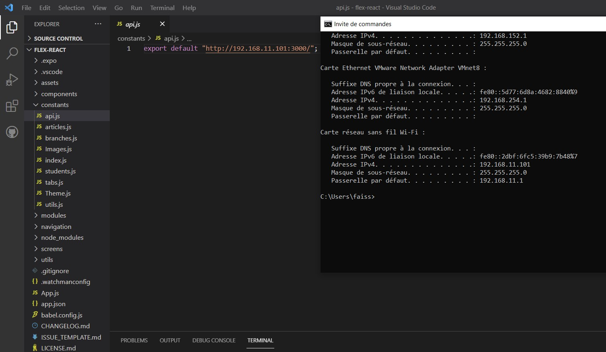

# Application mobile du système FLEX avec react native
## Présentation de FLEX
FLEX est projet unniversitaire innovant qui s’agit d’un système automatique,
d’objets interconnectés dont l’objectif est de faciliter l’accès aux salles de
cours en temps et en heure et de garantir aussi leur sécurité.
la principale fonctionnalité du système FLEX est sans aucun doute de faciliter l’accès aux salles de cours.
Parmi les caractéristiques de FLEX, nous pouvons citer :
* Permettre à la fois un contrôle automatique, commandé d’une salle,
tout en garantissant une ouverture manuelle en cas de panne.
* Gérer l’accès aux salles de façon optimisée 24h/24
* Garantir la disponibilité immédiate d’une salle à une heure donné et selon son emploi du temps
* Identifier et reconnaitre les différents intervenants à un instant donné afin de leur donner accès à la salle.
* Aider à l’établissement des listes de présence

## Stratégie du systéme FLEX
### Comment ça marche ?
Et bien voici une description simple des fonctionnalités de FLEX
* FLEX détecte et identifie les visages des professeurs afin de pouvoir
leur donner accès à une salle donné à condition que ce cours ou
événement soit prévu et ajouté à son emploi du temps.
* FLEX permet à un étudiant de pouvoir avoir accès à une salle de
cours grâce au code QR présente sur sa carte d’étudiant même si le
professeur n’est pas encore arrivé sur les lieux, mais à condition que
ce cours ou événement soit prévu et mentionné dans son emploi du
temps.
* Une fois une porte ouverte pour le déroulement d’un cours, FLEX
s’assure qu’elle reste ouverte jusqu’à la fin du cours ou de l’événement
en cours. Toute fois le professeur, qui dispose d’une application
mobile peut fermer et rouvrir la porte à tout moment.
* Grâce à cette même application mobile, un professeur pourra sortir la
liste des étudiants présents, programmer une séance de cours
inhabituelle et verrouiller une salle après son utilisation.
* FLEX verrouille automatiquement une salle 30 minutes après son
utilisation sauf sous indication contraire du prof ou au cas où un
autre cours suit juste après ou bien.
* La porte est à tout moment ouvrable manuellement, par tout individu
lorsqu’elle n’est pas bloquée, et par un agent de sécurité au cas
contraire.
 ### Objectifs
 Installé pour une salle de classe FLEX devrait être capable de réaliser
les actions citées ci-haut.
Nos objectifs techniques sont les suivantes :
* Un module électronique, installé localement pour chaque porte qui
aura pour objectif la reconnaissance faciale et la lecture des codes
QR afin d’envoyer les informations appropriées au serveur qui
dont la réponse déterminera si oui la porte doit être débloquée ou
non.
* Une plateforme d’administration web pour la gestion des
utilisateurs, des professeurs, des étudiants, des salles ainsi que de
leur emploi du temps
* <b>Une application mobile </b> destinée aux professeurs et dont les
fonctionnalités sont citées ci-haut.
* Une application serveur qui servira comme backend à tout ce qui
est cité précédemment.
### Lancer le projet FLEX en local
## 1. Mise en place de l'application Backend
Une fois Node.js installé sur votre environnement, vous pouvez récupérer le code de l’application Backend:

```
git clone https://github.com/AbidarYassine/flex_backEnd
```
Ensuite il faut installer les dépendances:


```
npm install
```

Une fois les dépendances installées, il ne reste plus qu’à lancer l’application :

```
npm start
```
## 2. Créer une base données flex_db (MySQL)
## 3. Mise en place de l'application mobile
Une fois React Native installé sur votre environnement, vous pouvez récupérer le code de l’application, disponible sur ce dépôt GitHub.

```
git clone https://github.com/FaissalElfid/Flex
```
Ensuite il faut installer les dépendances:

```
npm install
```
Puis il faut changer l'adress de l'api-backend avec son propre adresse local (où le mobile et serveur sont connéctés):
<br>

<br>
Une fois les dépendances installées, il ne reste plus qu’à lancer l’application :

```
npm start
```